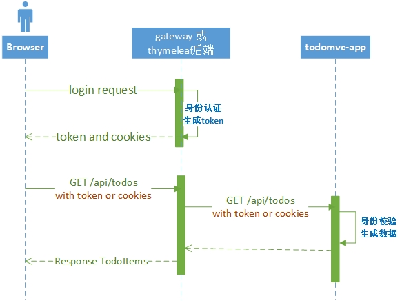

# oss-todomvc-security

## 简介

本项目为oss-todomvc的公共的安全认证模块，主要包括如下功能： 
+ 定义用户登录、认证逻辑
+ 存储用户信息
+ 提供测试用户

本项目旨在向开发者演示：
+ lib-security库的简单使用
+ RPC场景下的安全认证流程

在oss-todomvc项目中用于以下方面：
+ oss-todomvc-app项目的资源访问身份认证；
+ 将安全层挂在代理上，提供oss-todomvc-gateway的用户登录以及后续访问的身份认证支持；
+ 将安全层放在服务消费者，提供oss-todomvc-thymeleaf的用户登录及后续访问的身份认证支持。

## 设计思路

todomvc系列项目的登录以及后续认证流程如下图所示：

### 用户登录逻辑

1. 接收客户端通过form表单提交用户名密码
2. 校验用户名和密码。`lib-security`会根据认证的结果以及应用的类型执行不同的操作：
    + 认证通过
        - RESTFUL类型的APP，返回加密的cookie、token以及用户的基本信息；  
        - TEMPLATE类型的APP，会跳转到开发人员指定的页面； 
        - MIXED类型的APP，会进行内容协商，根据请求类型从上面两种方式中选择。
    + 认证失败
        - RESTFUL类型的APP，返回401。  
        - TEMPLATE类型的APP，会跳转 `/error` 页面； 
        - MIXED类型的APP，会进行内容协商，根据请求类型从上面两种方式中选择。

> RESOURCE类型的APP，不提供用户登录的支持。

### 后续资源请求认证逻辑

+ 用户通过cookie或者`X-Auth-Token`携带token的方式，向后端发起资源请求；
+ 如果认证通过，继续执行后续的处理逻辑；如果认证失败，操作与上一节的处理方案一致。

### security在zuul代理以及服务发现中的传递
+ 无论通过cookie还是token的方式，依赖的lib-security会自动处理认证信息传递，用户不需要关注；
+ `oss-todomvc-app`、 `oss-todomvc-jquery` 、`oss-todomvc-react`共用同一套认证逻辑以及cookieKey和jwtKey。

